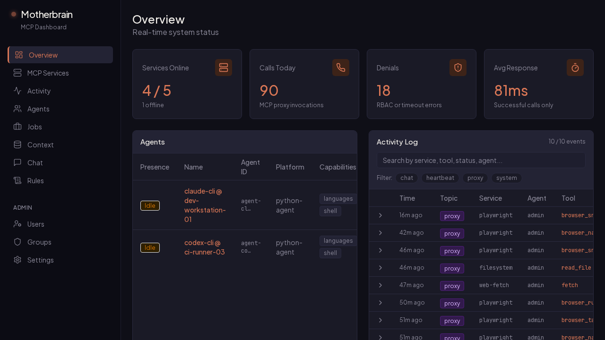
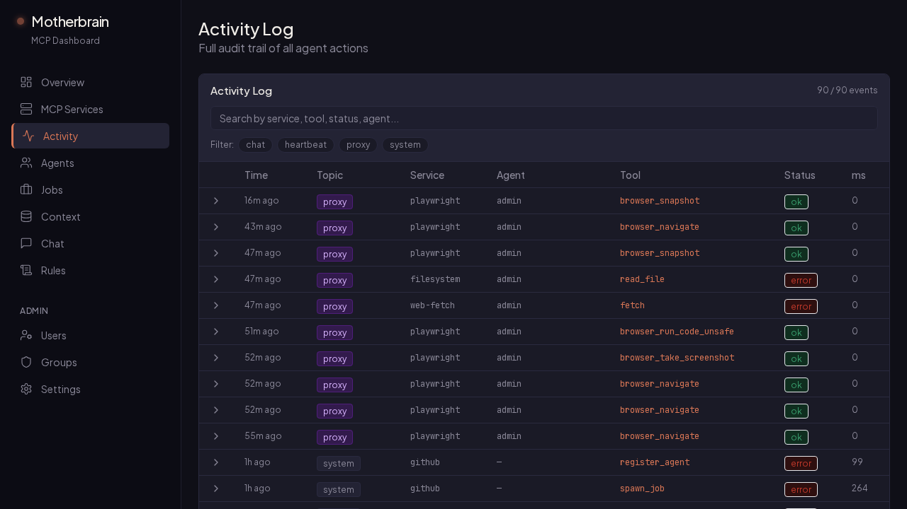
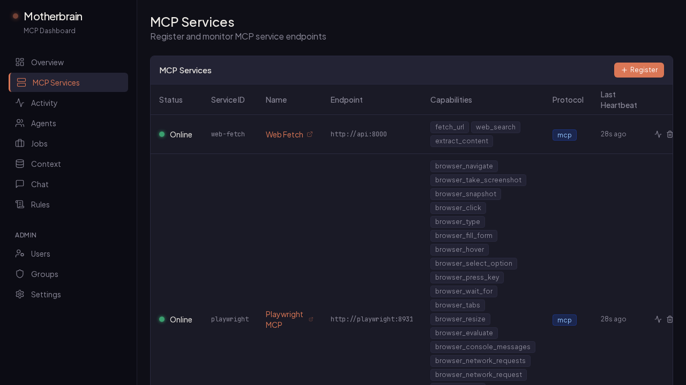
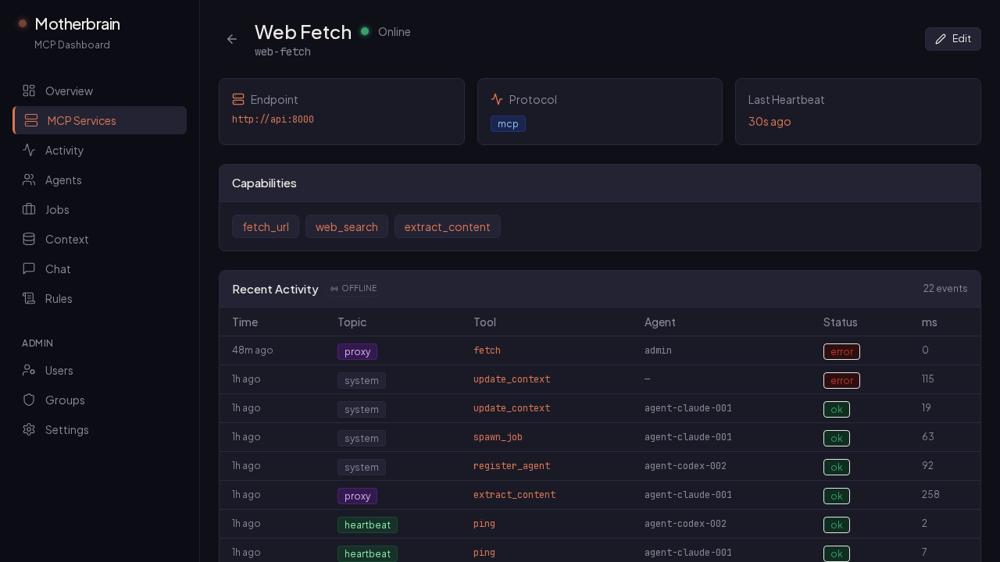

# Motherbrain

A self-hosted MCP gateway for production AI agents.  
Audit logging. RBAC. Capability discovery. One endpoint.

```bash
docker compose up -d && make demo
```



---

## The Problem

You're running AI agents in production. They're calling MCP tools. You have no idea what they're doing, who's authorized to call what, or how to audit any of it.

Raw MCP has no access control, no audit trail, and no health monitoring. Every agent connects directly to every service. When something breaks, you have no logs. When someone calls a tool they shouldn't, you have no guardrails.

## The Answer

Motherbrain is a gateway that sits between your agents and your MCP services. Every tool call is logged. Access is controlled by RBAC groups. Services are health-monitored. You get a dashboard.

One endpoint. Full visibility. Controlled access.

## Why Motherbrain?

| Raw MCP | Motherbrain |
|---|---|
| No audit log | Full event log — every call with args, response, agent, duration |
| No access control | Users + groups + per-service permissions |
| No observability | Health monitoring, latency tracking, denial logging |
| Direct service connections | Single gateway endpoint — agents talk to one URL |

## Features

### Audit & Compliance
Every tool call is logged with full context: caller identity, arguments, response, status, and duration. Search and filter by service, agent, tool, or topic. Sensitive fields (tokens, passwords, API keys) are automatically redacted before storage.



### RBAC
Users belong to groups. Groups grant access to specific MCP services. Unauthorized calls are denied and logged. Admin users bypass all checks for emergency access.

### Service Health & Discovery
30-second HTTP probes on every registered service. Online/offline status in the dashboard. Last heartbeat tracked per service. Click any service to see its full capability list and recent activity feed.





### Real-Time Streaming
The dashboard activity log updates live via SSE — no polling. Connect directly: `GET /api/event-log/stream` with optional `?topic=` and `?service_id=` filters.

### Observability
Prometheus metrics at `/metrics`: total proxy calls, latency histograms, services online, agents online. Drop into any Grafana setup.

---

## Quickstart

Prerequisites: Docker + Docker Compose

```bash
git clone https://github.com/irpina/motherbrain-mcp.git
cd motherbrain-mcp
cp .env.example .env
docker compose up -d
make demo        # seed realistic demo data
```

- **Dashboard:** http://localhost:3000
- **API docs:** http://localhost:8000/docs
- **MCP endpoint:** http://localhost:8000/mcp
- **Metrics:** http://localhost:8000/metrics

The demo seeds 4 MCP services, 3 users with RBAC groups, 80+ gateway events (including a denial arc), agents, jobs, and rules. The Overview page shows gateway metrics: Services Online, Calls Today, Denials, Avg Response.

## Architecture

```
┌─────────┐     ┌─────────────┐     ┌─────────────────────────────┐
│  Agent  │────→│ Motherbrain │────→│  filesystem  (read_file…)   │
│ (Claude │     │   Gateway   │     │  github      (get_pr…)      │
│  Desktop│     │             │     │  web-fetch   (fetch_url…)   │
│  etc.)  │     │  • Audit    │     │  internal-api (offline)     │
└─────────┘     │  • RBAC     │     └─────────────────────────────┘
                │  • Health   │
                │  • Metrics  │
                └─────────────┘
                       │
                ┌──────┴──────┐
                │  Dashboard  │  ←── SSE live stream
                │  (Next.js)  │
                └─────────────┘
```

Agents connect to one endpoint. Motherbrain routes calls, enforces permissions, logs everything, and exposes a real-time dashboard.

*The services above are seeded by `make demo`. Register your own with `POST /mcp/register`.*

## Registering an MCP Service

```bash
# Set API_KEY in your .env file
curl -X POST http://localhost:8000/mcp/register \
  -H "Content-Type: application/json" \
  -H "X-API-Key: $API_KEY" \
  -d '{
    "service_id": "my-service",
    "name": "My MCP Service",
    "endpoint": "http://host.docker.internal:8010"
  }'
```

Motherbrain registers the service, begins health-probing every 30 seconds, and lists it in the gateway dashboard.

## Connecting an LLM Client

Add Motherbrain to your Claude Desktop config:

```json
{
  "mcpServers": {
    "motherbrain": {
      "url": "http://localhost:8000/mcp"
    }
  }
}
```

With RBAC enabled, pass your user token:

```json
{
  "mcpServers": {
    "motherbrain": {
      "url": "http://localhost:8000/mcp",
      "headers": {
        "X-User-Token": "mb_your_token_here"
      }
    }
  }
}
```

## Permission System (RBAC)

- **Users** — `user` or `admin` role. Identified by tokens (SHA-256 hashed in DB).
- **Groups** — named collections with an `allowed_service_ids` list.
- **Membership** — users belong to groups; groups grant service access.
- **Admin bypass** — admins can call any service regardless of group.

Manage users and groups via the **Admin** section of the dashboard or the REST API.

---

## Also Included

Motherbrain also includes agent orchestration, job dispatch, a shared context/skill store, and agent chat — see the API docs at `/docs` for the full feature set.

## Tech Stack

| Layer | Tech |
|---|---|
| Gateway | FastAPI + FastMCP |
| Dashboard | Next.js 15 + Tailwind CSS |
| Database | PostgreSQL 15 (asyncpg) |
| Cache / Queue | Redis 7 |
| Migrations | Alembic (auto-applied on startup) |
| Metrics | Prometheus + prometheus-fastapi-instrumentator |

## Development

```bash
make up       # Start all services
make down     # Stop
make logs     # Follow logs
make shell    # Shell into API container
make demo     # Seed demo data
make doctor   # Diagnose DB, Redis, API, services
```

## Environment Variables

| Variable | Description | Default |
|----------|-------------|---------|
| `DATABASE_URL` | PostgreSQL connection string | `postgresql+asyncpg://postgres:postgres@db:5432/motherbrain` |
| `REDIS_URL` | Redis connection string | `redis://redis:6379` |
| `API_KEY` | Master API key — **change before any deployment** | *(required)* |
| `CORS_ORIGINS` | Comma-separated allowed origins for the dashboard | `http://localhost:3000` |
| `REDACT_FIELDS` | Extra comma-separated field names to redact from logs | *(optional)* |

## What's New in v3.0

- **Prometheus metrics** — `/metrics` endpoint with proxy call counters, latency histograms, and online gauges for services and agents
- **PII/secret redaction** — tokens, passwords, API keys, and credentials are automatically stripped from audit log entries before they hit the database
- **Real-time SSE streaming** — activity log updates live in the dashboard; `GET /api/event-log/stream` for direct integration
- **Service detail pages** — click any service to see its endpoint, protocol, full capability list, and a live activity feed
- **`make doctor`** — diagnostic command that checks DB, Redis, API health, registered service reachability, and dashboard availability
- **Architecture docs** — `docs/architecture.md` with component diagram and data flow; `docs/production-checklist.md` for deployment hardening

## License

MIT
